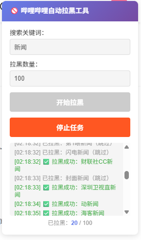

# 社交平台自动拉黑工具

针对社交平台关键词搜索用户（如「日报」「新闻」等营销号）进行批量拉黑的油猴脚本。支持抖音、哔哩哔哩等平台。

[](https://github.com/Steven-Qiang/social-block-kit/actions/workflows/release.yml)
[](./LICENSE)
[](./package.json)

<div align="center">
  
  
</div>

## 特性

- 🎯 关键词搜索用户
- 🚫 批量自动拉黑
- 📊 实时进度显示
- ⏸️ 支持暂停/停止
- 🔄 自动跳过已拉黑用户
- 🌐 多平台支持（抖音、哔哩哔哩）
- 🎨 自适应界面
## 支持平台

- ✅ [抖音网页版](https://www.douyin.com)
- ✅ [哔哩哔哩](https://www.bilibili.com)
- 🔄 更多平台开发中...

## 安装

1. 安装 [Tampermonkey](https://www.tampermonkey.net/)
2. [点击安装脚本](https://github.com/Steven-Qiang/social-block-kit/releases/latest/download/social-block-kit.user.js)
3. 访问支持的平台网页版

## 使用

1. 登录对应平台网页版
2. 右上角出现控制面板
3. 输入关键词（如：新闻、日报）
4. 设置拉黑数量
5. 点击开始

> 💡 脚本会自动检测当前平台并调用对应的API

## 开发

```bash
pnpm install
pnpm run build
```

## License

MIT
